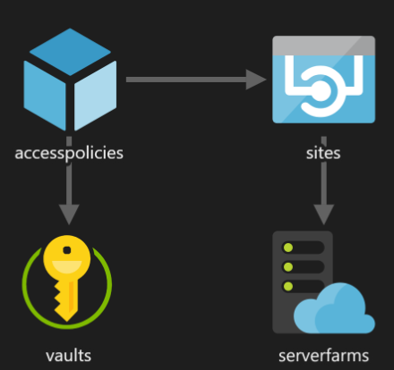

# Shared Access Key Example

## Introduction

This sample shows how an API can be protected by a shared access key.  This kind of security can be implemented as a backdoor security measure when the API is published via API Management.
The API Management Gateway should in this case add an additional header to the backend API.  The backing API verifies if the required header is present and contains the correct value.

## Azure Resources

To get this sample working, you'll need to provision the Azure resources that are described in the `.\AzureResources\resources.json` ARM template.

This schema displays the resources that are being deployed and how they depend on each other:

## Shared Access Key Verification

The access key is being verified using an AuthorizationFilter.  This repository contains the [SharedAccessKeyFilter](src/Infra/SharedAccessKeyFilter.cs) class which performs the eventual check.  
This class has been included just to make it easier to see what is actually being done.  In real projects, I strongly suggest to make use of the functionality that is offered by the [Arcus Web Api](https://webapi.arcus-azure.net/) NuGet package which is freely available.
